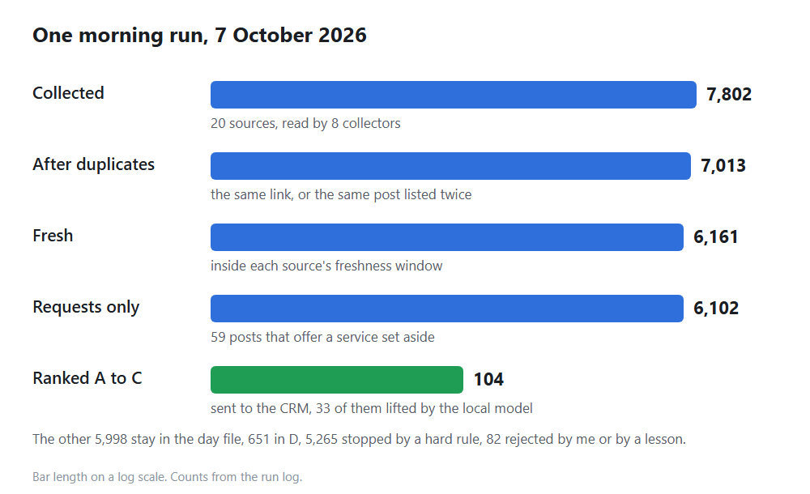
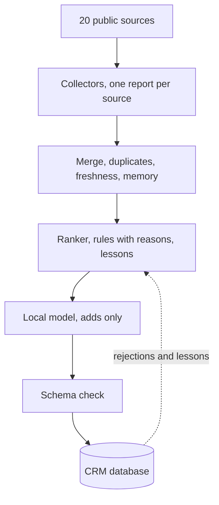

# Radar, a daily collect-and-rank pipeline

A pipeline that collects opportunities from public sources every morning, ranks them against a written profile and explains every rank.

I use it to find leads for my studio. The same automation, collect from public sources, rank against a written profile and learn from every rejection, fits other jobs too, like tracking tenders, suppliers or competitor prices. One collector already opens government tender PDFs and pulls out their entry requirements, like turnover, experience and insurance.

Solo project since September 2026. It runs every morning on a Linux server, and the ranked rows land in my [Finance and CRM Platform](https://github.com/offart/finance-crm-platform), where I review them.

**Highlights**

- Each source is read the way it publishes, a public API, a feed, forum JSON, data embedded in the page or server HTML, and one source that only works in a browser through a headless browser, without getting around any protection.
- Every row gets a grade from A to F and a one-line reason, and every rule in the ranker records where it came from.
- My rejections feed the next morning's ranking, and a small model running on the same server reviews only the rows the rules could not place. It can add work for me, never remove it, and costs nothing per call.

## Engineering notes

### Zero is not one answer

A blocked request, a page that changed its structure and a quiet day all come back as zero rows. Every collector writes a report for each source, what was asked, the status, the size of the answer and how many rows came out, and the daily run lists every source that came back empty without being quiet by design. This morning it flagged a page that now builds itself in the browser, so a plain request gets an empty shell. Before the run, a preflight checks that one source is reachable from the server, and it warns without stopping the run.

### Polite by default

The collectors that walk many pages cap how many requests run at once and keep a gap between two hits on the same site. One source throttled a full morning walk one page before the end, so its pace was slowed. A throttled or busy answer is waited out and retried with growing pauses, and only a source that still refuses after three tries is reported, with the status it really got. A slowdown never reads as an empty day.

### A reason for every grade

Rows from 20 sources are merged with duplicates removed, kept only while fresh, and remembered between runs under a stable key, so only what I have not seen before is new today. Every rule in the ranker carries a note on where it came from, a line in the profile, a measurement or a decision, and every row shows the reason for its grade. Hebrew postings often write a word with both gender endings, so the text is folded to one form before any rule runs, and the rules read titles in Hebrew, English, Dutch and Italian.

### Feedback that changes tomorrow

When I reject a row in the CRM, it sinks to F in the next run and stays in the file, nothing is deleted. I can also mark a few words as a lesson, and from then on any row that carries all of them as whole words sinks or rises. Each morning the run writes back what every lesson caught, and I get a warning when a lesson swallows too much of the top grades or fits a row I judged the other way. The matcher lives twice, in JavaScript here and in TypeScript in the CRM, and both run the same 21 test cases from identical files.

### A local model that can only add

The rules stop at the title, so a real fit written in plain words can fall to D. A small open model on the server's CPU reads only those rows, ones held back by a missing signal and nothing else. A yes lifts the row to C, marked for review. A no, an error or a model that is down leaves the row exactly as it was. No call leaves the server, so there is no token bill, answers are cached, and each morning has a time budget, with the rest left for the next day. On 7 October it read 231 rows, answered 209 from its cache, and 33 of the 104 rows sent to the CRM were there because of its yes.

## How it is checked

- **35 Node tests**, 28 on the lesson matcher and 7 on the model check, including that a no, an error or an unknown answer leaves a row unchanged.
- **35 Vitest tests** on the TypeScript twin of the matcher in the CRM, on the same 21 cases.
- **A schema check before the CRM database.** A bad row stops the push and fails the run with an alert, instead of failing quietly on the other side.
- **Daily runs.** The morning runs from 2 to 7 October all finished. A run that stops, a refused push or a model check that did not run sends a message to my phone.

All tests passing on 7 October 2026.

## Architecture

## Stack

Node.js with built-in fetch and node:crypto and a single npm package, Playwright, Firestore REST API, a small open model served locally, systemd on Linux, node:test, and TypeScript with Vitest on the CRM side.

## Source code

The code lives in a private repository. A private code review is available to hiring teams by arrangement.

Meir Mizrahi, [offart.space](https://offart.space), meir@offart.space
